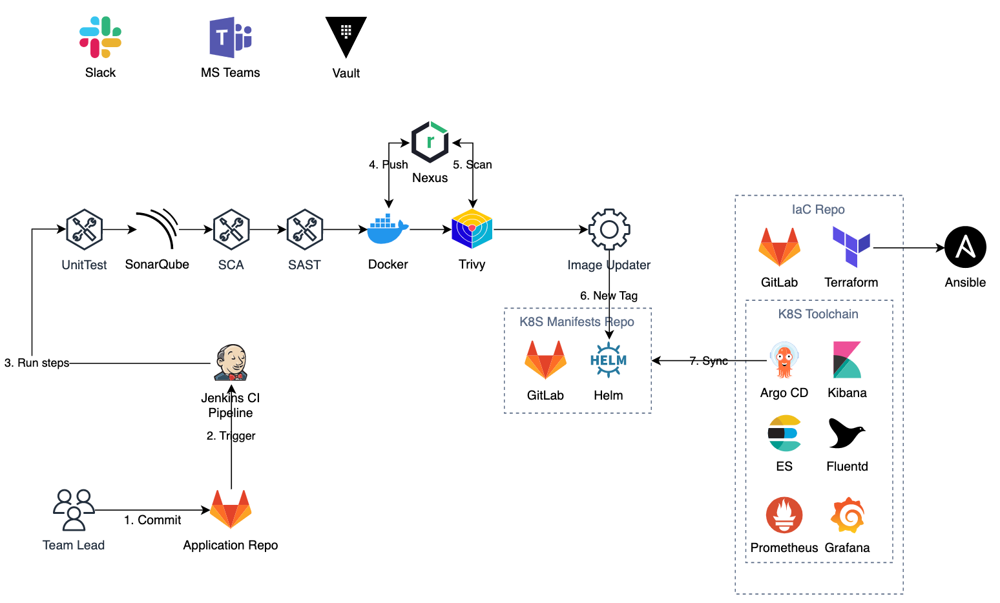

# IaC for Kubernetes addons, AWS resources and configuration

## High-level Architectural Diagram


## Code Structure

* Terragrunt folder holds the environment configurations and generate environment specific config base on the .hcl files. .hcl in each environment section will pass its own values to the root .hcl file
* Modules folder holds all the Terraform modules
* Examples folder holds different the usages of the module in the repository

# Usage

## Local Kubernetes Cluster for testing

Configure kind nodes
```yaml
# kind.yaml
kind: Cluster
apiVersion: kind.x-k8s.io/v1alpha4
nodes:
 - role: control-plane
   image: kindest/node:v1.26.0
 - role: worker
   image: kindest/node:v1.26.0
 - role: worker
   image: kindest/node:v1.26.0
```

Work with cluster
```sh
# Create Kind clusters
kind create cluster --name=<your cluster name> --config=kind.yaml
# Destroy Kind cluster
kind destroy cluster --name=<your cluster name>
```

After the cluster is ready, we bootstrap the whole infrastructure

```sh
#Init the dependencies
terraform init -backend-config=backend/dev.backend.hcl

terraform plan -var-file=environments/dev.tfvars
terraform apply -var-file=environments/dev.tfvars
# Apply all addons 
make up
# Destroy all addons
make down
```

For local Kubernetes cluster (Kind) due to having no LoadBalancer implementation, we have to port-forward the ingress controller to mock the traffic for ingress rule
```sh
kubectl port-forward --address 0.0.0.0 svc/ingress-nginx-controller -n ingress-nginx 80
kubectl port-forward --address 0.0.0.0 svc/ingress-nginx-controller -n ingress-nginx 443
```

```sh
# If K8S has a LoadBalancer implementation then the ingress host will be the following output
INGRESS_HOST=(kubectl -n ingress-nginx get svc/ingress-nginx-controller -o jsonpath='{.status.loadBalancer.ingress[0].ip}')
# If K8S is local and has no LoadBalancer implemenetation then the ingress host will be 
INGRESS_HOST=https://127.0.0.1.nip.io/
```
