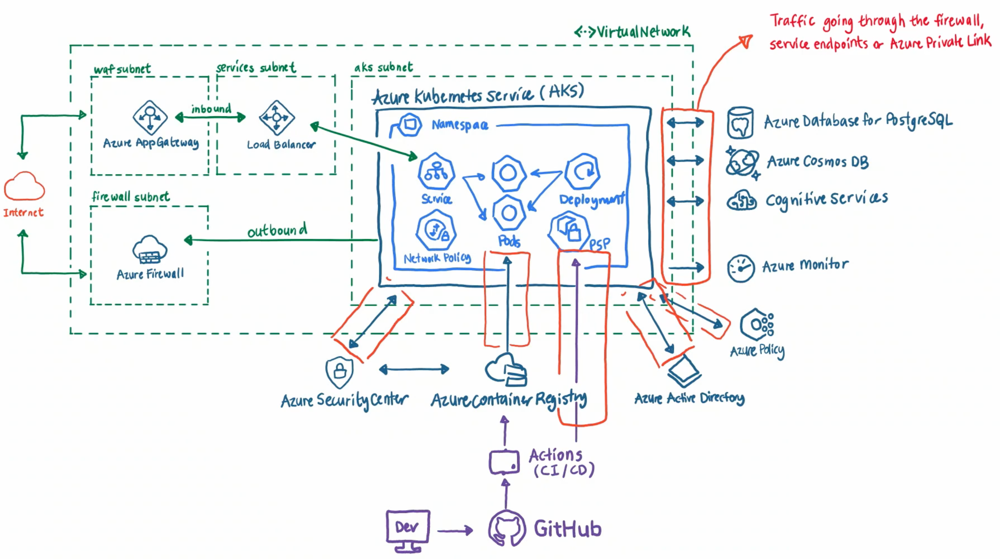

# Azure Kubernetes Service (AKS) baseline cluster

### Current implementation

Ref: https://youtu.be/fRU3-TbXiwg

## The future implementation
### Core architecture components

#### Azure platform

- AKS v1.25
  - System and User [node pool separation](https://learn.microsoft.com/azure/aks/use-system-pools)
  - [AKS-managed Azure AD](https://learn.microsoft.com/azure/aks/managed-aad)
  - Azure AD-backed Kubernetes RBAC (_local user accounts disabled_)
  - Managed Identities
  - Azure CNI
  - [Azure Monitor for containers](https://learn.microsoft.com/azure/azure-monitor/insights/container-insights-overview)
- Azure Virtual Networks (hub-spoke)
  - Azure Firewall managed egress
- Azure Application Gateway (WAF)
- AKS-managed Internal Load Balancers

#### In-cluster OSS components

- [Azure Workload Identity](https://learn.microsoft.com/azure/aks/workload-identity-overview) _[AKS-managed add-on]_

